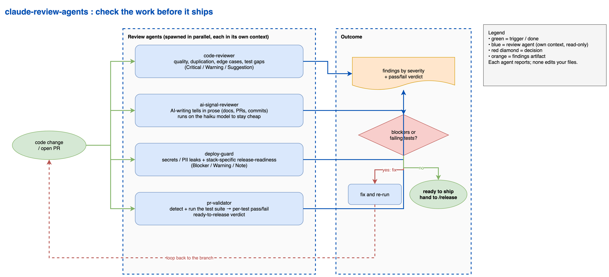

# Claude Code review agents

Four Claude Code agents that check your work before it ships: one for code quality, one for writing, one for release-readiness across common stacks, and one that runs a pull request's tests and certifies whether it is ready to release.

## The flow



Source: [docs/review-agents-flow.drawio](docs/review-agents-flow.drawio) (editable in draw.io).

## How these work

A Claude Code agent is a subagent with its own context window and a restricted set of tools. Claude can invoke one on its own when the description matches what you are doing, or you can ask for it by name. Each runs its review and reports back without editing your files, so the noise of a review stays out of your main conversation and you keep control of the changes.

- **`code-reviewer`**: senior code review for quality and maintainability. Reads the pending `git diff`, reports findings as Critical / Warning / Suggestion with file:line and a concrete fix. Looks at clarity, duplication, error handling, edge cases, over-large functions, test coverage, and consistency with the surrounding style. Reviews only; does not edit.
- **`ai-signal-reviewer`**: checks human-facing prose (docs, READMEs, PR descriptions, commit messages, emails) for AI writing tells and formatting traps: em dashes, AI-typical vocabulary, significance inflation, rule-of-three, elegant variation, curly quotes, and Unicode box-drawing characters in tables. Flags each issue with its location and a short replacement rather than rewriting the piece. Runs on the `haiku` model to keep it cheap; change the `model:` line in the file if you want a different one.
- **`deploy-guard`**: pre-ship release-readiness review. Reads the pending diff, detects the stack, and reports Blocker / Warning / Note findings. Universal checks (secrets and PII leaks, config and prod hygiene, deploy-target safety) run on every project. Stack-specific profiles apply only when the diff touches that stack: Python/Django on Render (settings, migrations, POST-only views, i18n, persistent-disk and memory-accounting traps), Node/JS services, Docker, static frontends, LLM SDK usage, and Power Automate/M365. It states which stack(s) it detected at the top of its report.
- **`pr-validator`**: runs a pull request's test suite and writes a release verdict. Reads the PR (or the branch diff against its base), summarizes what changed, detects and runs the project's test runner (pytest, npm test, Django, go test, and so on), then reports a complete per-test pass/fail list. If every test passed it marks the PR **ready for release**; if anything failed, the suite could not run, or there are no tests, it returns the PR to the programmer with the failing tests named. It runs the tests but does not edit, fix, merge, or deploy. A Claude Code agent runs inside a session, so invoke it right after you open a PR (it does not fire on the GitHub PR event by itself).

## Install

Copy the agent files into your Claude Code agents directory:

```bash
mkdir -p ~/.claude/agents
cp agents/*.md ~/.claude/agents/
```

They are available immediately. Ask for one by name ("have the code-reviewer look at this"), or let Claude pick them up on its own when you are about to ship.

## Notes

- None of the agents edit your files; they report so you decide what to change. Three are read-only reviewers; `pr-validator` also runs the test suite (it executes tests but changes nothing else).
- `code-reviewer` and `deploy-guard` split the work: `code-reviewer` stays on code quality, `deploy-guard` covers the shipping checks (secrets, framework correctness, deploy target). Running both before a release covers each side once.
- `pr-validator` is the test gate before release: run it right after you open a PR to get a pass/fail verdict on the suite. It answers "do the tests pass?", which the two reviewers do not check.
- `ai-signal-reviewer` enforces a plain-prose style (no em dashes, no marketing vocabulary, no box-drawing characters in tables). Edit the rule list in the file to match your own house style.

## License

MIT. See [LICENSE](LICENSE).
